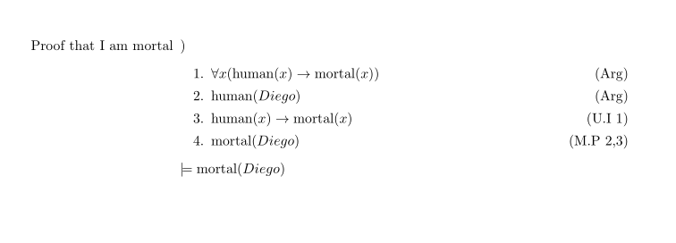

# LParse - A tiny language to render predicate logic arguments
I created this language in a weekend instead of actually doing my homework. You
known, to optimize a 30 minute task (writing latex docs) into a minute or less!

The language itself took 48 hours to create, so obviously it was well worth it!



## How to use it
`LParse` transforms its input into a `.tex` file containing valid `LaTeX`. You
can then turn this document into a PDF, web page, etc. using the many available
`LaTeX` renderers.

Every document has the following structure:
```
[config]
author: <Your name>
title: <Your document's title>
date: <Any string you want to be shown as a date>
default_clause: <Default method name. If you don't specify, it's "Arg">

[<section name>]
1) <equation> | <additional info>
2) <equation> | <additional info>
n+1) <equation> | <additional info>
|= <equation>

[<another section name>]
1) <equation> | <additional info>
2) <equation> | <additional info>
n+1) <equation> | <additional info>
|= <equation>

```

### Language
The following definitions are simple examples designed to teach how to write
documents. You are encouraged to look at the `Technical` section if you're lost.
#### `equation`
Is a set of expressions that represent some predicate logic.
  - `@x (p(x))` -> `@` translates to "For all" followed by whatever is inside
  parenthesis or square brackets
  - `&e [p(x) -> g(x)]` -> `&` translates to "Exists" followed by whatever is inside
  - `@x (&y [g(x) ^ p(y)])`
  - `y ^ x` -> `^` translates to `and`
  - `y V x` -> `V` or `V` translates to `or`
  - `z -> x V m` -> `->` translates to the `arrow` operator
  - `~z V (x ^ y)` -> `~` translates to a `negation`
#### `section name`
Can contain anything other than square brackets (`[]`). Will be shown in the
final output suffixed by a `)`, followed by the corresponding arguments, conclusion, etc.
  - `1-b` -> `1-b)`
  - `proof of concept` -> `proof of concept)`

### `additional_info`
Anything you want to be shown after the equation. Usually, it's the method used
to derive the argument. Must be inside a paranthesis (`()`)
```
[Modus ponens]
1) p(x) -> q(x) | Premise
2) p(x) | Premise
3) q(x) | (M.p 1, 2)
```

### config
The config section has special syntax which associates names (keys) with values.
All values accept any string of characters, including spaces, all brackets,
unicode, etc.

Keep in mind quotes are left as-is.
```
[config]
title = Assignment 1 - P.L
author = Diego Augusto
date = November of 2023

```

### Technical
- `<section name>`: a string containing most unicode characters, except for
square brackets (`[]`) and newlines.
- `<pred_name>`: a string containing only: `ASCII` alphanumeric characters,
  undescore (`_`) and hyphen (`-`)
- `<expression>` (also known as `<expr>`):
    - Existencials (you can use either `()` or `[]`):
        - `@<pred_name> (expr)`
        - `&<pred_name> (expr)`
    - Binary operations:
        - `<expr> -> <expr>`
        - `<expr> V <expr>`
        - `<expr> ^ <expr>`
    - Negation:
        - `~<expr>`
    - Sub expression:
        - `(<expr>)`
    - Functional predicates
        - `<pred_name>([<expr>, <expr2>, ...])`


